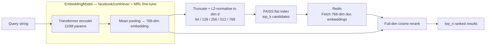
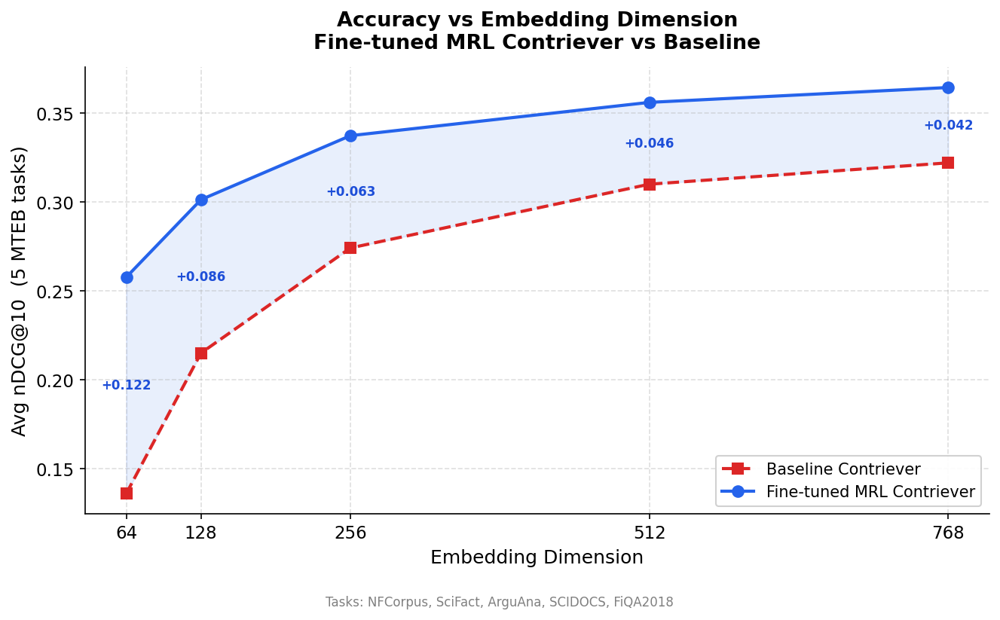
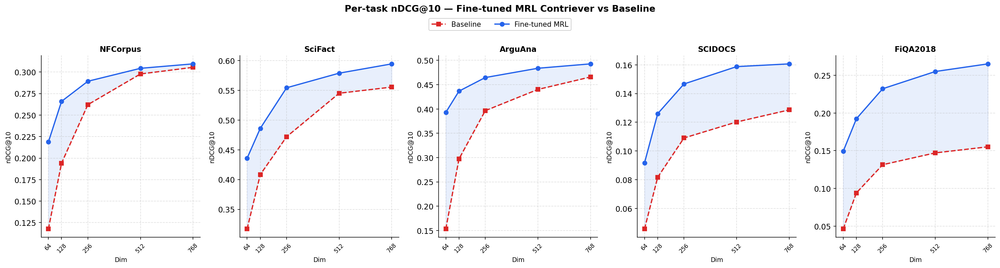
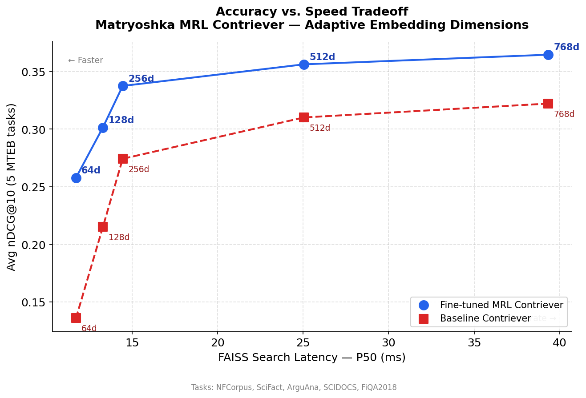

<div align="center">

# Elastic Embeddings — Matryoshka Representation Learning

**Adaptive-dimension semantic search: one model, five embedding sizes, real-time latency/accuracy tradeoffs**

[](https://hub.docker.com/r/abdullahrashid/matryoshka-api)
[](https://www.python.org/)
[](https://pytorch.org/)
[](https://fastapi.tiangolo.com/)
[](https://huggingface.co/facebook/contriever)
[](https://redis.io/)
[](https://github.com/facebookresearch/faiss)
[](https://wandb.ai/)
[](LICENSE)

</div>

---

## Overview

Modern embedding models output fixed-size vectors, if you want smaller, faster embeddings you have to retrain from scratch. This project demonstrates **Matryoshka Representation Learning (MRL)**, a training technique that produces a single embedding model that works correctly at any dimension prefix: 768d, 512d, 256d, 128d, or 64d. The information is nested inside the vector like a Matryoshka doll, the most discriminative features are concentrated in the first dimensions, allowing you to truncate at inference time with a well-characterised accuracy/speed tradeoff. This matters in production when you need to serve different latency SLAs from a single deployed model, a mobile client gets 64d, a batch pipeline gets 768d, same weights.

I fine-tuned `facebook/contriever` using a custom multi-scale InfoNCE loss with hard negatives over 180,000 triplets from MS MARCO, Natural Questions, and HotpotQA. The result is a model deployable via a FastAPI service backed by FAISS and Redis which is fully containerised with Docker Compose and ready to pull from Docker Hub.

---

## Architecture



### Why Mean Pooling?
Unlike CLS token pooling, mean pooling produces embeddings that are proportional to token attention across the entire sequence, giving `contriever` its well known robustness on long passages.

### Why FAISS Flat (exact search)?
With 100k documents, approximate IVF methods do not yet yield a speedup over exact search on CPU. The FAISS flat index gives perfectly accurate candidate retrieval and allows measuring the pure embedding-dimension latency effect.

---

## Matryoshka Loss Function

The custom loss (`src/models/loss.py`) computes **in-batch InfoNCE at every matryoshka dimension simultaneously**:

```python
class MatryoshkaInfoNCELoss(nn.Module):
    def forward(self, anchor_embs, positive_embs, negative_embs):
        total_loss = 0
        for dim in self.dims:                          # [768, 512, 256, 128, 64]
            a = F.normalize(anchor_embs[:, :dim], ...)
            p = F.normalize(positive_embs[:, :dim], ...)
            n = F.normalize(negative_embs[:, :dim], ...)

            sim_matrix = (a @ p.T) / self.temperature  # in-batch negatives
            hard_neg   = (a * n).sum(-1) / self.temperature  # explicit hard neg
            logits     = torch.cat([sim_matrix, hard_neg], dim=1)

            total_loss += cross_entropy(logits, labels)
        return total_loss
```

**In-batch InfoNCE** treats every other sample in the batch as a negative, scaling loss coverage to `O(batch_size)` with no extra forward passes. **Hard negatives** push the model to distinguish semantically close but non-relevant passages. Summing the loss across all 5 dimension scales forces the model to maintain meaningful geometry at every prefix.

---

## Training

| Parameter | Value |
|-----------|-------|
| Base model | `facebook/contriever` |
| Architecture | BERT-style encoder, 110M params, 768-dim output |
| Training data | 180,000 hard-negative triplets (MS MARCO, NQ, HotpotQA) |
| Loss | `MatryoshkaInfoNCELoss` — multi-scale InfoNCE with hard negatives |
| Matryoshka dims | 768, 512, 256, 128, 64 |
| Batch size | 96 |
| Epochs | 2 |
| Learning rate | 2e-5 (with linear warmup, 10%) |
| Temperature | 0.07 |
| Weight decay | 0.0001 |
| Optimizer | AdamW |

Training data sourced from `thebajajra/hard-negative-triplets` — see [data/README.md](data/README.md) for attribution.

---

## What the numbers actually show

Standard retrieval benchmarks reward absolute ranking quality. That is not what this project optimises for. The goal is to characterise the accuracy/latency Pareto frontier of a single model. The key questions are: how gracefully does quality degrade as you truncate? How much does MRL training improve that degradation curve versus naive truncation of a baseline model? The results show a consistent and widening advantage at smaller dimensions, exactly the property MRL training is designed to produce.

---

## Results

### Accuracy vs Embedding Dimension



### Per-task Breakdown (5 MTEB retrieval tasks)



### Accuracy vs Search Latency



### Pareto Frontier Results

| Dim | FAISS P50 (ms) | Avg nDCG@10 (Fine-tuned) | Avg nDCG@10 (Baseline) | Gain vs BL | Speedup vs 768d |
|:---:|:--------------:|:------------------------:|:----------------------:|:----------:|:---------------:|
| 768 | 39.3 | 0.365 | 0.322 | +0.042 | 1.0× |
| 512 | 25.1 | 0.356 | 0.310 | +0.046 | 1.6× |
| 256 | 14.5 | 0.337 | 0.274 | +0.063 | 2.7× |
| 128 | 13.3 | 0.301 | 0.215 | +0.086 | 3.0× |
| 64 | 11.7 | 0.258 | 0.136 | **+0.122** | 3.4× |

Evaluated on 5 MTEB retrieval tasks: **NFCorpus, SciFact, ArguAna, SCIDOCS, FiQA2018**.

> **Key insight:** The thesis of this project is not the absolute nDCG scores, it is the MRL property itself. A single fine-tuned model exposes five deployment profiles with no retraining. At 128d you retain 82% of full-dimensional accuracy at 3× lower latency. At 64d, the MRL fine-tune outperforms the untuned baseline by +90% in nDCG@10, demonstrating that without multi-scale training, small-dimension embeddings collapse in quality. The fine-tuning is what makes truncation viable, not just fast.

> **Compute context:** This model was trained under significant compute constraints, 2 epochs, batch size 96, 180k triplets. The absolute retrieval scores reflect those constraints, not a ceiling on the approach. The relative gains (especially at low dimensions) are the meaningful signal.

---

## Tech Stack

| Layer | Technology |
|-------|-----------|
| Model training | PyTorch 2, HuggingFace Transformers & Datasets |
| Embeddings | `facebook/contriever` (BERT-style encoder) |
| ANN index | FAISS (flat L2 with dimension slicing) |
| Document store | Redis (in-memory key-value, cosine reranking payloads) |
| Inference API | FastAPI + Uvicorn |
| Containerisation | Docker Compose (multi-service: api + redis) |
| Evaluation | MTEB (5 retrieval tasks) |
| Experiment tracking | Weights & Biases |

---

## Quickstart (Docker)

The entire service which consists Redis, document index, model, and API is bundled into a single Docker Compose stack. No manual setup required.

**Prerequisites**: Docker and Docker Compose installed.

```bash
# 1. Clone the repo (for docker-compose.yml)
git clone https://github.com/abdullahhrashid/elastic-matryoshka-embeddings.git
cd elastic-matryoshka-embeddings

# 2. Start the full stack (pulls ~8GB image from Docker Hub on first run)
docker compose up -d

# 3. On first boot the container auto-loads 100k documents into Redis (~90s)
#    Watch logs:
docker compose logs -f api
```

Once you see `Application startup complete.`, the API is ready at **http://localhost:8000**.

```bash
# Health check
curl http://localhost:8000/health

# Search at 128d (fast)
curl -X POST http://localhost:8000/search \
  -H "Content-Type: application/json" \
  -d '{"query": "what causes type 2 diabetes", "dim": 128, "top_k": 100, "top_n": 5}'

# Search at full 768d (highest accuracy)  
curl -X POST http://localhost:8000/search \
  -H "Content-Type: application/json" \
  -d '{"query": "what causes type 2 diabetes", "dim": 768, "top_k": 100, "top_n": 5}'
```

Interactive API docs (Swagger UI): **http://localhost:8000/docs**

---

## API Reference

### `POST /search`

Performs semantic search over 100,000 MS MARCO passages.

**Request body:**

| Field | Type | Default | Description |
|-------|------|---------|-------------|
| `query` | string | **required** | Natural language query |
| `dim` | int | `768` | Embedding dimension — one of `64, 128, 256, 512, 768` |
| `top_k` | int | `100` | FAISS candidates retrieved before reranking |
| `top_n` | int | `10` | Final results returned after reranking |

**Example request:**
```json
{
  "query": "symptoms of iron deficiency",
  "dim": 256,
  "top_k": 100,
  "top_n": 5
}
```

**Example response:**
```json
{
  "query": "symptoms of iron deficiency",
  "dim": 256,
  "results": [
    {
      "rank": 1,
      "doc_id": 12847,
      "score": 0.842,
      "text": "Iron deficiency anemia signs and symptoms may include: Extreme fatigue, Weakness, Pale skin..."
    }
  ]
}
```

**Search pipeline:** The query is encoded to a 768-dim embedding → truncated and L2-normalised to `dim` → searched in the corresponding FAISS flat index for `top_k` candidates → full 768-dim embeddings fetched from Redis → cosine-reranked → `top_n` results returned.

---

### `GET /health`

Returns service health status and loaded FAISS index dimensions.

**Response:**
```json
{
  "status": "ok",
  "dims_loaded": [64, 128, 256, 512, 768],
  "model": "facebook/contriever (MRL fine-tuned)"
}
```

---

## Project Structure

```
matryoshka/
├── checkpoints/
│   └── v1_fb_contriever/
│       └── checkpoint_epoch_2.pt      # Fine-tuned MRL model (~1.3 GB)
├── configs/
│   └── config.yaml                    # Training hyperparameters
├── data/
│   ├── indexes/                       # FAISS indexes + embeddings + texts
│   └── README.md                      # Dataset attribution
├── notebooks/
│   └── build_index_colab.ipynb        # FAISS index builder (GPU, Colab)
├── results/
│   ├── contriever_mrl.json            # Full MTEB evaluation results
│   ├── latency_benchmark.json         # Per-dim FAISS latency (200 queries)
│   ├── accuracy_vs_speed.png          # Pareto: accuracy vs latency
│   ├── pareto_accuracy_vs_dim.png     # Accuracy vs dimension (averaged)
│   └── pareto_per_task.png            # Accuracy vs dimension (per-task)
├── scripts/
│   ├── train.py                       # Training entry-point
│   ├── evaluate.py                    # MTEB evaluation runner
│   ├── build_index.py                 # Encodes corpus → FAISS indexes
│   ├── load_redis.py                  # Bulk-loads embeddings into Redis
│   ├── benchmark.py                   # Latency benchmarker (200 MS MARCO queries)
│   ├── plot_tradeoff.py               # Generates accuracy_vs_speed.png
│   ├── tokenize_data.py               # Tokenizes raw text to sequences
│   └── plot_pareto.py                 # Generates pareto plots
├── src/
│   ├── api/
│   │   ├── app.py                     # FastAPI application
│   │   └── pipeline.py                # MRLSearchPipeline (encode→FAISS→Redis→rerank)
│   ├── data/
│   │   ├── load_data.py               # Streaming data loader
│   │   └── prepare_dataset.py         # Tokenisation pipeline
│   ├── models/
│   │   ├── embedding_model.py         # EmbeddingModel (contriever + mean pool)
│   │   └── loss.py                    # MatryoshkaInfoNCELoss
│   ├── training/
│   │   └── trainer.py                 # Training loop
│   └── utils/
│       ├── config.py                  # YAML config loader
│       └── logger.py                  # Structured logger
├── Dockerfile
├── docker-compose.yml
├── entrypoint.sh                      # Waits for Redis, auto-populates, starts uvicorn
└── pyproject.toml
```

---

## Local Development Setup

```bash
git clone https://github.com/abdullahhrashid/elastic-matryoshka-embeddings.git
cd elastic-matryoshka-embeddings

python -m venv venv && source venv/bin/activate
pip install -e .

# Copy your fine-tuned checkpoint + FAISS indexes to:
# checkpoints/v1_fb_contriever/checkpoint_epoch_2.pt
# data/indexes/faiss_*.index, embeddings_768.npy, doc_ids.npy, texts.json

# Start Redis
docker run -d -p 6379:6379 --name matryoshka-redis redis:alpine

# Load documents into Redis
python scripts/load_redis.py

# Start API server (with hot-reload)
uvicorn src.api.app:app --reload --port 8000
```

**Reproducing benchmarks:**
```bash
python scripts/benchmark.py          # Saves results/latency_benchmark.json
python scripts/plot_tradeoff.py      # Saves results/accuracy_vs_speed.png
python scripts/plot_pareto.py        # Saves results/pareto_*.png
```

---

## Reproducing Training

```bash
# Download and tokenise training data
python scripts/tokenize_data.py --config configs/config.yaml

# Train
python scripts/train.py --config configs/config.yaml

# Evaluate (MTEB)
python scripts/evaluate.py --config configs/config.yaml

# Build FAISS indexes
python scripts/build_index.py
```

Training data credit: [`thebajajra/hard-negative-triplets`](https://huggingface.co/datasets/thebajajra/hard-negative-triplets).

---

## License

MIT
